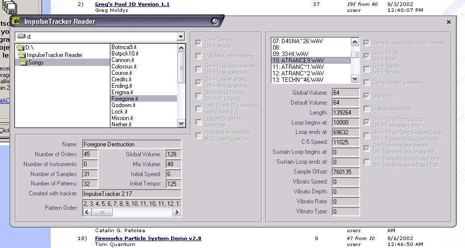



## ImpulseTracker Reader \(Now Plays Samples\!\)

### Description

Well here I am again, updating one of the hardest projects I have ever taken on! My ImpulseTracker file reader. This update is probably the biggest since I started this project. Now the program can read all of the information for each sample in any IT file. Not only can it read the information on the samples, but it can also load the data for each sample into a DirectX8 sound buffer and play them! Let me know what you think about this project by leaving some comments, or email me! Oh, and I'm not even gonna bother asking you guys to vote on this project because you guys never do anyway! =)
 
### More Info
 

             |
---                |---
**Submitted On**   |2002-08-08 16:15:44
**By**             |[Chris Dwinell](https://github.com/Planet-Source-Code/PSCIndex/blob/master/ByAuthor/chris-dwinell.md)
**Level**          |Advanced
**User Rating**    |4.8 (38 globes from 8 users)
**Compatibility**  |VB 6\.0
**Category**       |[Sound/MP3](https://github.com/Planet-Source-Code/PSCIndex/blob/master/ByCategory/sound-mp3__1-45.md)
**World**          |[Visual Basic](https://github.com/Planet-Source-Code/PSCIndex/blob/master/ByWorld/visual-basic.md)
**Archive File**   |[ImpulseTra115942882002\.zip](https://github.com/Planet-Source-Code/chris-dwinell-impulsetracker-reader-now-plays-samples__1-37745/archive/master.zip)

